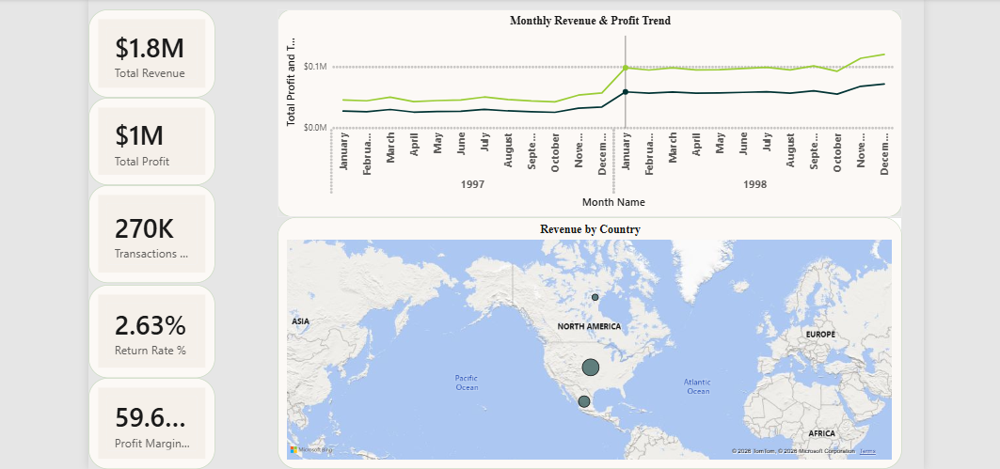
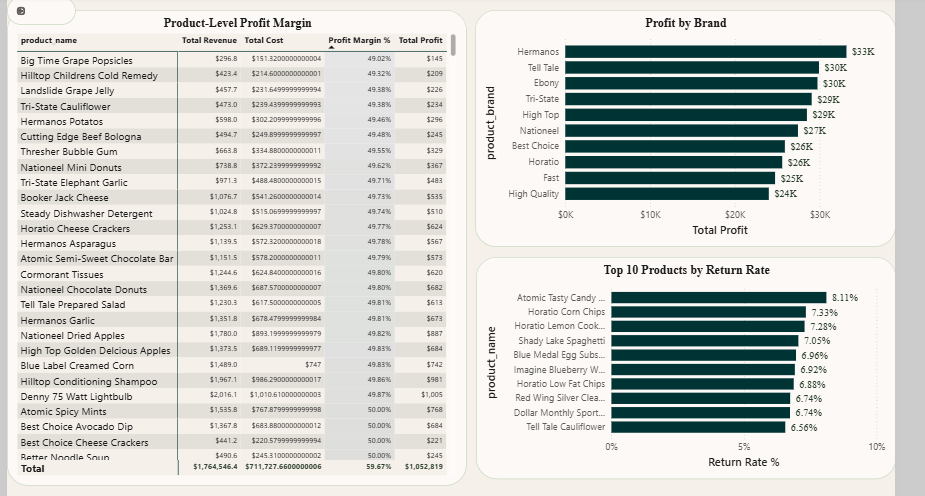
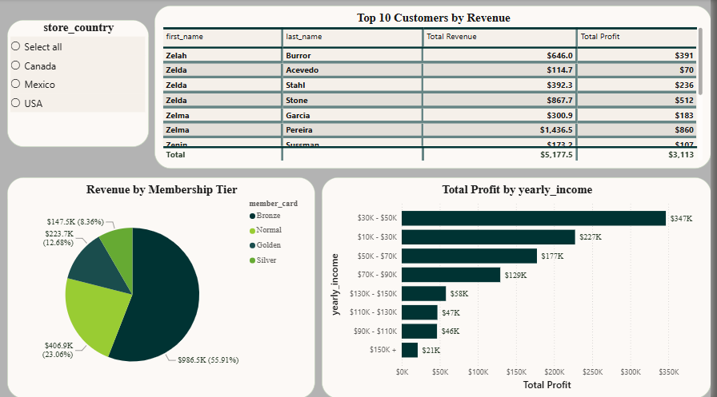
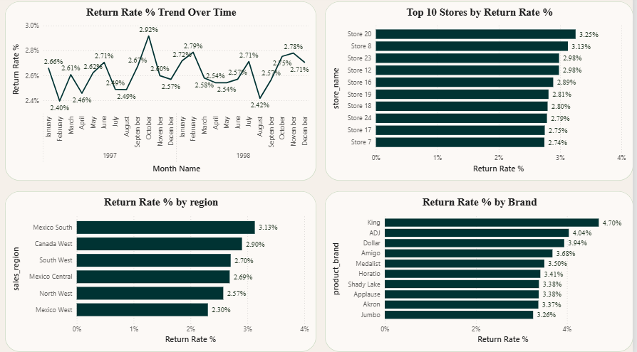

# Maven Market Sales Dashboard (Power BI)

## 📌 Project Overview
An end-to-end Power BI analytics project built on the **Maven Market** dataset — a multi-national grocery retail chain operating across **Canada, Mexico, and the United States**. The project delivers a decision-ready sales dashboard covering revenue, profitability, product performance, customer behavior, and returns.

## 🎯 Objectives
- Track overall sales performance (revenue, profit, transactions) over time
- Identify top/bottom performing products and brands
- Understand customer segments and their contribution to revenue
- Monitor and analyze product return rates across stores, regions, and brands

## 🗂️ Data Source
The **Maven Market** dataset (public training dataset), consisting of 8 CSV files:

| File | Description |
|---|---|
| `MavenMarket_Transactions_1997.csv` / `1998.csv` | Sales transaction line items |
| `MavenMarket_Returns_19971998.csv` | Product return line items |
| `MavenMarket_Products.csv` | Product catalog (name, brand, price, cost) |
| `MavenMarket_Customers.csv` | Customer demographics |
| `MavenMarket_Stores.csv` | Store details |
| `MavenMarket_Regions.csv` | Sales district/region mapping |
| `MavenMarket_Calendar.csv` | Date table (1997–1998) |

## 🏗️ Data Model
Built as a **Star Schema** in Power BI:

- **Fact tables:** `Fact_Transactions`, `Fact_Returns`
- **Dimension tables:** `Dim_Products`, `Dim_Customers`, `Dim_Stores`, `Dim_Regions`, `Dim_Calendar`
- `Dim_Calendar` is marked as the official **Date Table**
- The 1997 and 1998 transaction files were appended into a single `Fact_Transactions` table during Power Query transformation

## 📐 Key Measures (DAX)
9 core measures built in dependency order — see [`Measures_Documentation.md`](./Measures_Documentation.md) for full details:

- Total Revenue, Total Cost, Total Profit, Profit Margin %
- Transactions Count, Returns Count
- Quantity Sold, Quantity Returned, Return Rate %

## 📊 Report Pages
1. **Executive Overview** — KPI cards, monthly revenue/profit trend, revenue by country
2. **Products** — product-level profit margins, profit by brand, top 10 products by return rate
3. **Customers** — top customers by revenue, revenue by membership tier, profit by income band
4. **Returns** — return rate trend over time, top stores/regions/brands by return rate

## 📸 Screenshots

## 🔑 Key Insights
- Total Revenue: **$1.76M** | Total Profit: **$1.05M** | Profit Margin: **~59.7%**
- Return Rate: **~2.63%** of transactions result in a return
- Revenue is concentrated in a small number of top customers and high-membership tiers
- Return rates vary meaningfully by store, region, and brand — useful for quality/supply chain investigation

## 🛠️ Tools Used
- Power BI Desktop (Power Query, Data Modeling, DAX)
- Star Schema modeling methodology

## 📁 Repository Structure
- `Maven Market Project.pbix`
- `README.md`
- `Measures_Documentation.md`
- `Data_Dictionary.md`
- `screenshots/`
  - `executive_overview.png`
  - `products.png`
  - `Customers.png`
  - `returns.png`

## 👤 Author
Murwan — Data Analytics Portfolio Project
